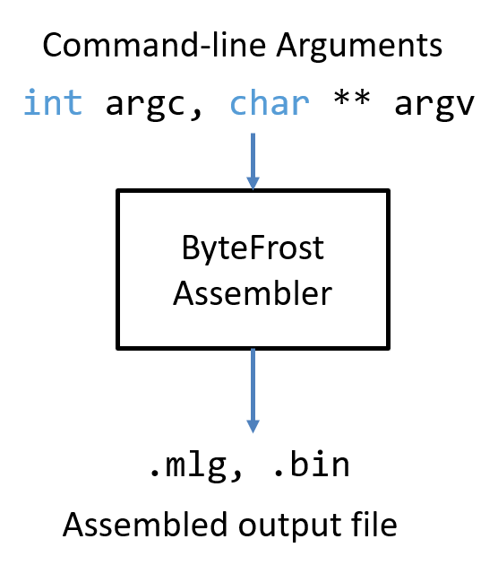
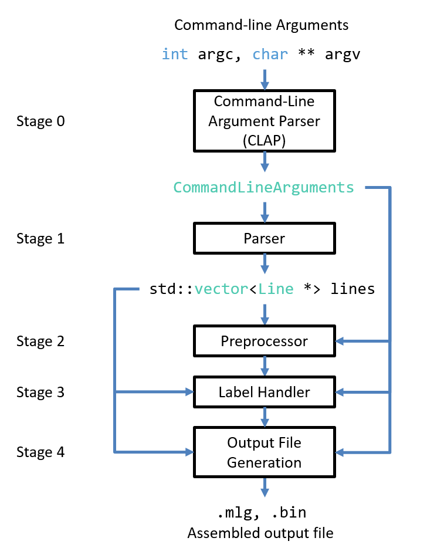

#   Software Pipeline Overview

The ByteFrost Assembler is a complex piece of software that contains multiple
pipeline stages.

The Assembler is a CLI tool, and so its inputs are command-line arguments.
These must specify an input `.asm` file to assemble, and optionally include
additional flags to alter the operation and output of the Assembler.



The ByteFrost Assembler software pipeline is as follows:



The ByteFrost Assembler's command-line arguments are sent to the Command-Line
Argument Parser (CLAP), which parses the command-line arguments and generates a
`CommandLineArguments` object, which contains the name of the input `.asm` file
as well as which flags have been set and what their arguments are, if any.

Then, the Parser opens the input `.asm` file specified in the 
`CommandLineArguments` object for reading; it stores a copy of the file in
memory as a vector of strings, then parses each line independently, generating a
`Line` object that represents that line's semantics (e.g., whether the line is
empty, contains an assembly instruction, a preprocessor directive, or a label
definition, and additional relevant data). These `Line` objects are stored in a 
vector of `Line *`s called `lines`.

The Preprocessor then passes over the `lines` vector and handles any 
preprocessor directives as well as attempts to replace any uses of preprocessor
constants as assembly instruction arguments with their defined values.

The Label Handler also passes over the `lines` vector, keeping track of all
label declarations and replacing any uses of labels as assembly instruction
arguments with their corresponding memory addresses.

At this point, all of the assembly instruction arguments have known values, and
so the assembler begins to generate the assembled output file. With the output
file generated, the assembler finishes running.

##  Software Pipeline Implementation

Every software pipeline stage has its corresponding class (e.g., there exists
a `CLAP` class, a `Parser` class, etc.). Each class implements a `run()` method
which performs the tasks for its pipeline stage.

There is also an `Assembler` class which contains an instance of each pipeline
stage class and which encapsulates the software pipeline with its `run()` 
method, which runs each of the pipeline stages one after another by calling 
their corresponding class' `run()` methods.

Hence, the `Assembler::run()` method is quite simple; its implementation
is essentially as follows:

```cpp
void Assembler::run() {
    //  Run the ByteFrost Assembler pipeline to produce a machine language file
    //  from a given .asm file.
    //  Stage 0: Command-Line Argument Parsing (CLAP)
    //  CLAP generates a commandLineArguments object
    this->commandLineArguments = clap.run();

    //  Stage 1: Parser
    //  Parser fills the Assembler's empty std::vector<Line *> vector
    parser.run(this->lines, this->commandLineArguments, this->instructions, 
        this->directives);

    //  Stage 2: Preprocessor
    preprocessor.run(this->lines, this->commandLineArguments);

    //  Stage 3: Label Handler
    label_handler.run(this->lines, this->commandLineArguments);

    //  Stage 4: Output File Generation
    file_generator.run(this->lines, this->commandLineArguments);
}
```

The `Assembler` class is initialized with command-line arguments in `main()`
in `main.cpp`, which also calls the `Assembler::run()` method:

```cpp
//  main.cpp
int main(int argc, char ** argv) {
    //  Create Assembler
    Assembler assembler(argc, argv);

    //  Assemble input file
    assembler.run();
}
```