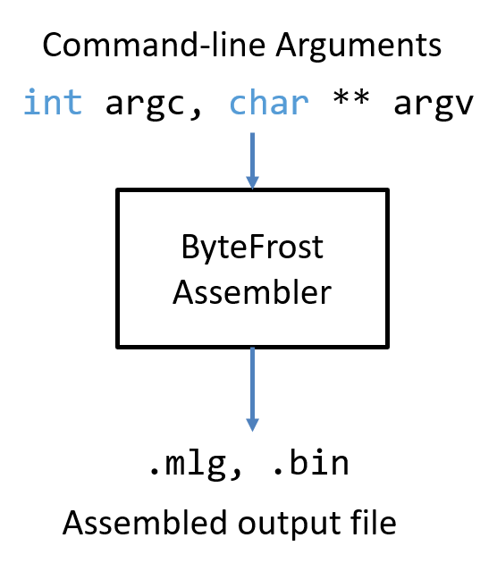
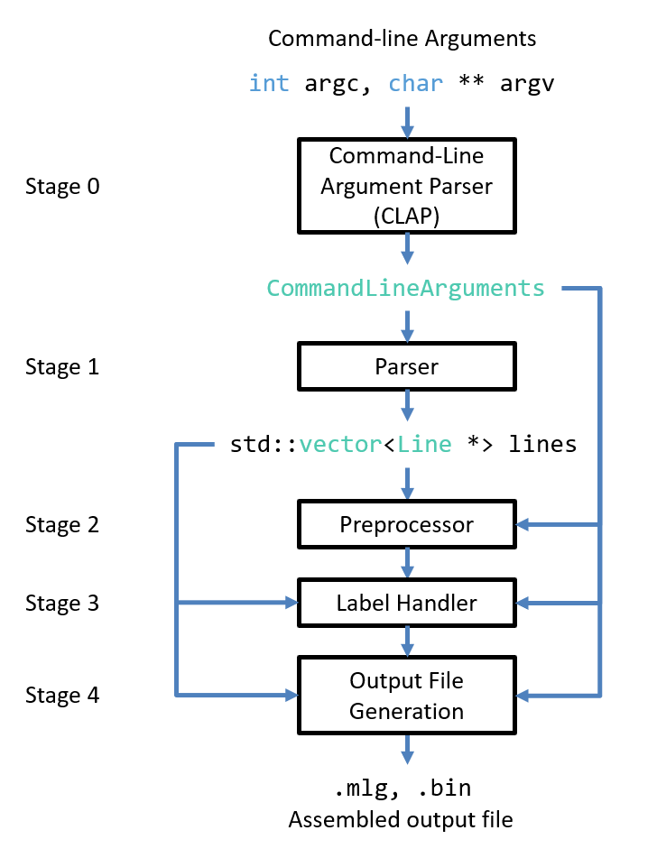

#   ByteFrost Assembler Handbook
Updated: September 25, 2024.

##  Overview

This handbook documents the ByteFrost Assembler software architecture (covered
in the *Developer Documentation* section) and includes a manual for how to use
the ByteFrost Assembler intended for programmers of ByteFrost Assembly (covered
in the *Programmer Manual* section).

##  Developer Documentation

### General Definitions

**`.asm` file** - a ByteFrost assembly file, each line of which may contain at
most one assembly statement.

**Token** - A *token* is a non-empty string that contains no delimiter 
characters and which is of an identified token type (meaning that the relevant
parser has marked the token's string with a type identifier that relates to its
semantics and expected use). The delimiter characters and possible token types
differ by parsers and context (e.g, the CLAP (*Stage 0*) uses different 
delimiters and token types than the Parser (*Stage 1*); hence the relevant
structs and enums are defined differently).

### Parsing Set Definitions

These set definitions are used in the parsing stages of the assembler pipelines.
Every token string is mapped to a token type (either `CLTokenType` in the CLAP 
or `TokenType` in the Parser) at least in part by checking whether the token
string or substrings of it are members of some of these sets.

####    Character (Symbol) Sets

1.  $ASCII$ is the set of ASCII characters.
    * $ASCII = \{x~|~ x \text{ is an ASCII character}\}$
2.  $A$ is the set of upper and lower case English characters.
    * $A = \{x~|~ x \text{ is an upper or lower case English character}\}$
3.  $D$ is the set of 10 numerical digits (0 - 9).
    * $D = \{0, 1, 2, 3, 4, 5, 6, 7, 8, 9\}$
4.  $H$ is the set of hexadecimal digits.
    * $H = D \cup \{a, b, c, d, e, f, A, B, C, D, E, F\}$

####    String Sets

5.  $TEXT$ is the set of possible variable names.
    * A string $s$ is in $TEXT$ iff the first character of $s$ is an underscore
     or in $A$, and every character in $s$ after the first character may be an
     underscore, in $A$, or in $D$.
    * $TEXT = (A \cup \{\_\})~\circ~(A \cup \{\_\} \cup D)^*$
6.  $ND$ is the set of unsigned decimal number strings.
    * $ND = \{0\} \cup (D \setminus \{0\})D^*$
7.  $NH$ is the set of unsigned hexademical number strings.
    * $NH = \{0x\} \circ H^+$
8.  $N$ is the set of unsigned number strings.
    * $N = ND \cup NH$
9.  $NUMBER$ is the set of (hexademical and decimal) number strings.
    * $NUMBER = \{\epsilon, -, +\} \circ N$
10. $FILE$ is the set of file names.
    * $FILE = TEXT \circ \{.\} \circ TEXT$
    * **Note:** This definition is possibly more restrictive than most file
    systems regarding acceptable file names. It may be prudent to redefine this
    set to allow for more expressive file names.
11. $INSTRUCTIONS$ is the set of recognized assembly instruction names.
    * $INSTRUCTIONS \subseteq TEXT$.
    * String membership in $INSTRUCTIONS$ can be checked by using the 
    `Assembler`'s `std::unordered_map<std::string, std::vector<AssemblyInstruction>> instructions` hashmap, initialized in the
    `Assembler` constructor.
12. $GREGISTERS$ is the set of general purpose register names.
    * $GREGISTERS \subseteq TEXT$.
    * $GREGISTERS = \{\texttt{R0}, \texttt{R1}, \texttt{R2}, \texttt{R3}\}$
13. $SREGISTERS$ is the set of special register names.
    * $SREGISTERS \subseteq TEXT$.
    * $SREGISTERS = \{\texttt{DHPC}, \texttt{HDP}, \texttt{HSP}\}$
    * **Note:** $SREGISTERS$ strings do NOT contain the `%` special register
    prefix; they are only the special register names.
14. $BYTE\_SELECT$ is the set of possible instances of byte selection (array
    indexing syntax)
    * $BYTE\_SELECT = \{\texttt{[}~\}~\circ ND~\circ \{~\texttt{]}\}$ 

### Software Pipeline

The ByteFrost Assembler is a complex piece of software that contains multiple
pipeline stages.

The Assembler is a CLI tool, and so its inputs are command-line arguments.
These must specify an input `.asm` file to assemble, and optionally include
additional flags to alter the operation and output of the Assembler.

<!--  -->


The ByteFrost Assembler software pipeline is as follows:

<!--  -->


The ByteFrost Assembler's command-line arguments are sent to the Command-Line
Argument Parser (CLAP), which parses the command-line arguments and generates a
`CommandLineArguments` object, which contains the name of the input `.asm` file
as well as which flags have been set and what their arguments are, if any.

Then, the Parser opens the input `.asm` file specified in the 
`CommandLineArguments` object for reading; it stores a copy of the file in
memory as a vector of strings, then parses each line independently, generating a
`Line` object that represents that line's semantics (e.g., whether the line is
empty, contains an assembly instruction, a preprocessor directive, or a label
definition, and additional relevant data). These `Line` objects are stored in a 
vector of `Line *`s called `lines`.

The Preprocessor then passes over the `lines` vector and handles any 
preprocessor directives as well as attempts to replace any uses of preprocessor
constants as assembly instruction arguments with their defined values.

The Label Handler also passes over the `lines` vector, keeping track of all
label declarations and replacing any uses of labels as assembly instruction
arguments with their corresponding memory addresses.

At this point, all of the assembly instruction arguments have known values, and
so the assembler begins to generate the assembled output file. With the output
file generated, the assembler finishes running.

### Stage 0 - Command-Line Argument Parser (CLAP)

####    Overview

This is the first stage of the ByteFrost Assembler pipeline.

Given the command-line arguments as specified by `int argc`, `char ** argv`
received by running the ByteFrost Assembler on a command-line shell, the
**Command-Line Argument Parser (CLAP)** generates a `CommandLineArguments`
object that contains the specified input file and any additional command-line
argument flags / values. The CLAP will throw an error or warning for any
command-line argument misuse. The generated `CommandLineArguments` is allocated
by the CLAP on the heap and a pointer to it is returned to the `Assembler`.

####    Definitions

#####   `CLTokenType`

The CLAP recognizes the following Command-Line Argument Token (`CLToken`) types,
which are the values of the `CLTokenType` enum:

```cpp
enum CLTokenType = {FLAG, NUMBER, FILE_NAME, TEXT, INVALID};
```

######  `FLAG`

A command-line argument string `w` is mapped to `CLTokenType::FLAG` if
1.  `w.length() >= 2`.
2.  `w[0] = '-'`.
3.  `w[1:end]` $\in TEXT$.

######  `NUMBER`

A command-line argument string `w` is mapped to `CLTokenType::NUMBER` if 
1. `w` $\in NUMBER$.

######  `FILE_NAME`

A command-line argument string `w` is mapped to `CLTokenType::FILE_NAME` if
1. `w` $\in FILE$.

######  `TEXT`

A command-line argument string `w` is mapped to `CLTokenType::TEXT` if
1. `w` $\in TEXT$.

######  `INVALID`

A command-line argument string `w` is mapped to `CLTokenType::INVALID` if
1. `w` cannot be mapped to any `CLTokenType` that is not `CLTokenType::INVALID`.

#####   `CLToken`

A `CLToken` is a struct containing a `CLTokenType` enum and a token string.

Every token string received by the CLAP as part of the command-line arguments
array `char ** argv` is mapped to a `CLTokenType` and stored in a `CLToken`.

```cpp
struct CLToken {
    CLTokenType type;
    std::string token_string;
}
```

#####    `CFlag`

The `CFlag` struct is defined as follows:

```cpp
struct CFLag {
    std::string flag_name;
    std::vector<CLTokenType> expected_pattern;

    //  Command-line flag's argument values filled by the CLAP if each 
    //  argument's CLTokenType matches the corresponding CLTokenType in the
    //  expected_pattern vector
    std::vector<CLToken> values;
    bool is_set = false;
}
```

The following are flags (`CFlag`s) that are recognized by the CLAP:

######  `-b`    Binary Flag
*   Use: When set, this flag tells the ByteFrost Assembler to produce a `.bin`
    file.
*   Flag name: `b`.
*   Number of arguments: 0.
*   Expected pattern: `{}`.

######  `-o`    Output File Name Flag
*   Use: When set, this flag tells the ByteFrost Assembler to produce an output
    file with the name specified by the following argument (`CLToken`).
*   Flag name: `o`.
*   Number of arguments: 1.
*   Expected pattern: `{FILE}`.


### Stage 1 - Parser

### Stage 2 - Preprocessor

### Stage 3 - Label Handler

### Stage 4 - Output File Generation

##  Programmer Manual