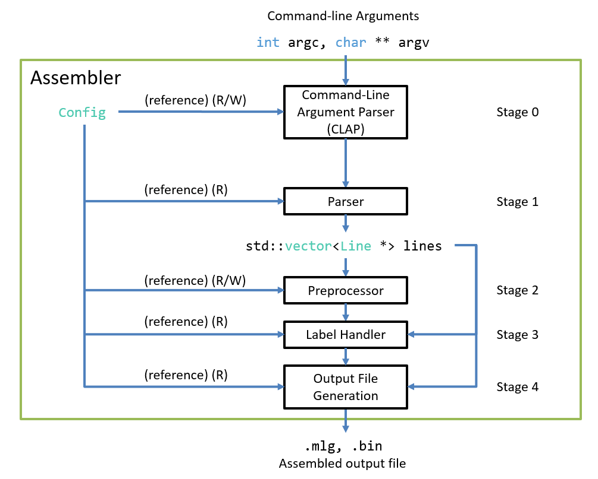

#   Assembler `Config` Object Proposal v3

May 14, 2025

##  Definitions

**property** - A property is a variable whose value is set externally to the
    Assembler (i.e., it can be considered as part of the Assembler's input) and
    which is read at some point during the Assembler's execution such that its
    value affects the Assembler's behavior.

Let $P$ be the set of properties that the Assembler recognizes.

A property can have one value at any given point out of a set of possible values
(just like any variable). Hence, for every property $p$ in $P$, there exists a 
set $V_p$ which is the set of all possible values of $p$.

(i.e., $\forall p \in P, \exists V_p$ where $V_p$ is the set of all possible
values of $p$).

Let $V$ be the union of all value sets of properties in $P$
(i.e., $V = \cup~X$ where $\exists p \in P$ such that $X = V_p$).

Then a **property-value pair** is therefore a tuple $(p, v) \in P \times V$.

$(p, v)$ denotes that property $p$'s current value is $v$.

A **valid** property-value pair is a tuple $(p, v) \in P \times V$ such that
$v \in V_p$ (this avoids nonsensical property-value pairs such as a boolean
property whose value is the string "banana", assuming there exists at least one
property $p$ whose value set $V_p$ is the set of character strings so that
$V_p \subseteq V$).

$P \times V$ is the set of all property-value pairs; let $M$ be the set of all
valid property-value pairs (i.e., $M \subseteq P \times V$).

A **configuration** is therefore a set $C \subseteq P \times V$ such that
$$\forall p \in P, ~\exists (p, v_1) \in C~\forall v_2 \in V, v_2 \neq v_1 \rightarrow (p, v_2) \notin C$$

In other words, every property in $P$ is mapped to exactly one value, and this
mapping is represented as a property-value pair in $C$ (and thus $|C| = |P|$).

(This also means that $C$ can be represented as a function $c: P \rightarrow V$
    where $\forall p \in P, c(p) = v \leftrightarrow (p, v) \in C$)

A **valid** configuration is a configuration $C$ such that
$\forall (p, v) \in C, v \in V_p$ (i.e., $(p, v)$ is a valid property-value
pair); alternatively, $C \subseteq M$.

##  Motivation

Currently, the `CommandLineArguments` object acts as a configuration $C_a$ which
is created and filled by the CLAP and then sent to every pipeline stage after it
for reading.

However, there are some limitations with this approach, as not all properties 
are best set using command-line arguments; consider for instance a "start
address" property, whose value denotes the address at which the compiled program
should be loaded. This address is linked with the "role" a program plays (i.e.,
a program with start address `0x0000` is necessarily a ROM program and therefore
is either a "bare-metal" program or some sort of bootloader; a program with
start address `0x2000` is a program that should be loaded into the RAM, and may
thus be more general-purpose), and so it would make more sense to specify the
start address in the assembly file of the program using a preprocessor
directive.

There are 3 (or possibly 4) possible source of setting property value pairs of
a configuration (i.e., of defining a configuration):

1.  Hardcoded Default Values
    *   This defines a default valid configuration $C_D \subseteq M$, hardcoded
        as part of the `Config` struct's default constructor.
2.  Command-Line Arguments
    *   Some properties can be set using command-line arguments.
    *   These property-value pairs are determined by the CLAP after it generates
        a `CommandLineArguments` object; for this proposal to be implemented,
        a new function would need to be added to update all properties in a
        given `Config` object based on the contents of a given
        `CommandLineArguments` object (i.e., the input file name and all set
        flags (each of which map to at least one property $p \in P$)).
3.  (Optional) External config file
    *   The config file name will need to be specified as a property-value pair
        if the name / path of an external config file could be set with a
        command-line flag.
4.  Preprocessor Directives
    *   Some properties can be set using preprocessor directives.
    *   These property-value pairs are determined by the Preprocessor when
        handling preprocessor directives that set a property / properties in 
        $P$ (e.g., `.start 0x3000`).

##  Implementation

A `Config` field would be added to the `Assembler` class, and a reference to it
will be passed to the constructor of every pipeline stage.

The CLAP and Preprocessor will write to (and possibly read from) the 
`Assembler`'s `Config` instance, while the other pipeline stages (Parser,
LabelHandler, and File Generation) will only read from the `Config` instance.

Since the `Config` instance will include all relevant property-value pairs, the
`CommandLineArguments` object will become internal to the CLAP, which after
generating it will read it and set the appropriate `Config` properties' values.

The new software pipeline of the Assembler will therefore look like this:



The implementation will therefore involve the following steps:

### `Config` Struct Definition

In `shared_types.hpp`:

```C++
struct Config {
    //  property-value pairs, grouped by the earliest entities that can set them
    //  (excluding defaults and external config files; i.e., only regarding
    //  the CLAP and the Preprocessor)

    //  ==  Properties that can be set with command-line arguments ==

    //  Input file name (using optional by default to avoid needing an "invalid"
    //  filename)
    std::optional<std::string> input_file_name;

    //  Output file name (using optional by default to avoid needing an "unset"
    //  output filename)
    std::optional<std::string> output_file_name;

    //  Whether the assembled output file should be a binary (.bin) file
    //  TODO: Replace boolean with an OutputFileType enum or something like this
    bool generateBinaryFile = false;

    //  ==  Properties that can't be set with command-line arguments but can be
    //      set with preprocessor directives ==

    //  Start address of program (i.e., where the program should be stored /
    //  loaded in memory)
    uint16_t start_address = 0x0000;
};
```

### Adding `Config` Instance to `Assembler` (and references to pipeline stages)

In `assembler.hpp`:

```C++
#include "shared_types.hpp"     //  Add #include so that Config is defined
                                //  Alternatively, can forward-declare Config

class Assembler {
public:
    //  ...
private:
    //  Global data

    Config config;

    //  TODO: Remove CommandLineArguments reference!
    CommandLineArguments * commandLineArguments;    //  remove this!

    //  ...
}
```

In `clap.hpp`: (add `Config &` member and update constructor; similar changes
    need to be done for every pipeline stage)

**Note:** It might be a good idea to make a `PipelineStage` abstract class
that includes a constructor, `void run(...)` method, and `Config &` member and
have all current pipeline stages inherit from it.

```C++
#include "shared_types.hpp"

class Clap {
public:
    //  CLAP constructor
    CLAP(int argc, char ** argv, Config config);

    //  ...
private:
    //  Reference to Assembler's Config instance
    Config & config;
    //  ...
}
```

In `clap.cpp`:

```C++
CLAP::CLAP(int argc, char ** argv, Config & config) : argc(argc), argv(argv),
    config(config) {}
```

In `assembler.cpp`:

```C++
Assembler::Assembler(int argc, char ** argv) : clap(argc, argv, config),
    parser(config), preprocessor(config), label_handler(config), 
    file_generator(config)
{
    //  ...
}
```

### Making `CommandLineArguments` Internal to the CLAP

Modify the signature of `CLAP::run()` to return `void`:

In `clap.hpp`:

```C++
class CLAP {
public:
    //  ...
    void run();
private:
    //  ...
}
```

In `clap.cpp`:

```C++
//  ...
void CLAP::run() {
    //  ...
}
```

Remove `CommandLineArguments` field from `Assembler` and its `run()` method:

In `assembler.cpp`:

```C++
//  ...
void Assembler::run() {
    //  ...
    clap.run();
    
    parser.run(this->lines, this->instructions, this->directives);

    preprocessor.run(this->lines);

    label_handler.run(this->lines);

    file_generator.run(this->lines);
}
```

####    Replacing external references to the `CommandLineArgument` with `Config`

