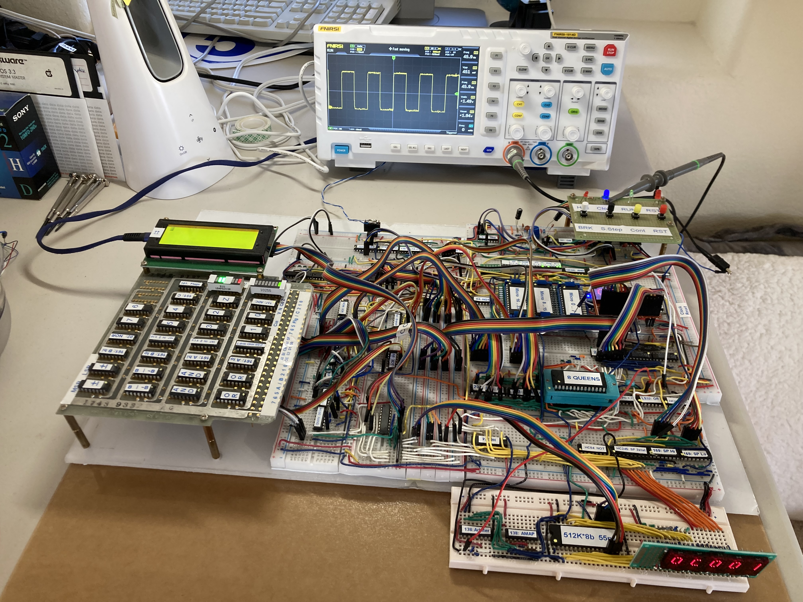

# ByteFrost 

The Breadboard 8-bit CPU and Computer

Be sure to check out the [YouTube channel](https://www.youtube.com/@bytefrost) for more in-depth explanations of how the ByteFrost works!

*ByteFrost under development*

In this Github repository are software tools for using the ByteFrost computer:

## Assembler
Assembler program that converts Assembly code to ByteFrost machine language.

**Note:** The `Assembler/` directory contains the deprecated assembler;
`Assembler V2/` contains the new assembler, which also has new preprocessing
features, assembly instructions that can be translated to multiple ISA
instructions, and support for the new 16-bit memory address space expansion.

## Display
Arduino code for the ByteFrost's display card (an Arduino Nano) for a 2004A LCD display.

## Disk
Arduino code for the ByteFrost's disk controller (an Arduino MKR Zero) for a
micro SD card that serves as the ByteFrost's disk.

Also included is software for handling ByteFrost disk files using the ByteFrost
FileSystem (BFSv1), a very rudimentary filesystem with one root directory.

## Documentation
Documentation for the ByteFrost computer. Includes hardware documentation (i.e. schematics) and software documentation (instruction set specifications, control signal lists, each instruction's micro-code and structure, and assembly syntax). For more documentation, see the [wiki](https://github.com/gilkeidar/ByteFrost/wiki).

## Microcode
Arduino code for programming the three microcode EEPROMs (using Ben Eater's [EEPROM programmer](https://github.com/beneater/eeprom-programmer/blob/master/eeprom-programmer/eeprom-programmer.ino) as a basis).

## Programs
Programs written in ByteFrost assembly that can be compiled using the assembler and run on the ByteFrost computer. Each program comes with the assembly code (`.asm` file), machine language compilation (`.mlg` file), and a binary file (`.bin` file).

##  Credits

The ByteFrost is a 2-person father-son project (by Gil and Ron Keidar) that we 
have been working on on-and-off (mostly during vacation between university 
quarters) for a few years (since March 2022).

My (Gil's) idea behind creating the ByteFrost was to work on a project that
covers many abstraction layers in computer science (all of the way from the
discrete logic layer to the application layer) and to, in the process, learn
about and get hands-on experience with those layers.